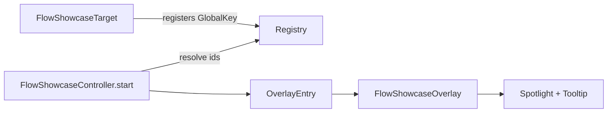

# flow_showcase

[](https://pub.dev/packages/flow_showcase)
[](LICENSE)

A lightweight, production-ready Flutter package for interactive onboarding walkthroughs. Highlight any widget with a blurred spotlight overlay, adaptive tooltip positioning, and multi-step navigation — with zero third-party runtime dependencies.

## Demo

<video src="showcase.mov" controls width="100%"></video>

## Features

- **Declarative targets** — wrap widgets once with `FlowShowcaseTarget` and start tours by id
- **Multi-step flows** — sequential walkthroughs with skip, next, and dot navigation
- **Adaptive layout** — tooltip and arrow flip above/below targets; responsive on mobile
- **Performance focused** — no external packages, single animation controller per step, minimal rebuilds
- **Customizable** — colors, blur, timing, copy, and dimensions via `FlowShowcaseStyle`
- **Memory safe** — registry cleanup on dispose, overlay removal on skip/complete

## Getting started

### Installation

Add `flow_showcase` to your `pubspec.yaml`:

```yaml
dependencies:
  flow_showcase: ^1.0.0
```

Then run:

```bash
flutter pub get
```

Import the library:

```dart
import 'package:flow_showcase/flow_showcase.dart';
```

### Quick start

1. Wrap UI elements you want to highlight:

```dart
FlowShowcaseTarget(
  id: 'profile_button',
  title: 'Your Profile',
  content: 'Manage your avatar and account settings here.',
  child: IconButton(
    icon: const Icon(Icons.person),
    onPressed: () {},
  ),
),
```

2. Start the walkthrough after the first frame (so targets are registered):

```dart
@override
void initState() {
  super.initState();
  WidgetsBinding.instance.addPostFrameCallback((_) {
    FlowShowcaseController.start(
      context,
      ids: ['profile_button'],
      onComplete: () => debugPrint('Tour finished'),
    );
  });
}
```

### Multi-step onboarding

Define targets with unique ids, then pass them in order:

```dart
FlowShowcaseController.start(
  context,
  ids: ['nav_home', 'nav_search', 'fab_compose'],
  onComplete: () => _markOnboardingComplete(),
  style: const FlowShowcaseStyle(
    nextButtonLabel: 'Continue',
    fadeDuration: Duration(milliseconds: 280),
  ),
);
```

Keep a reference if you need to cancel programmatically:

```dart
late FlowShowcaseController _tour;

_tour = FlowShowcaseController.start(context, ids: ids);
// later
_tour.skip();
```

## Customization

`FlowShowcaseStyle` controls overlay appearance and copy:

| Property | Default | Description |
|----------|---------|-------------|
| `overlayColor` | `0x4D000000` | Dimmed backdrop |
| `blurSigma` | `3.9` | Backdrop blur strength |
| `tooltipWidth` | `400` | Desktop tooltip width |
| `fadeDuration` | `350ms` | Entry animation |
| `nextButtonLabel` | `Next` | Primary button (last step shows `Done`) |
| `skipButtonLabel` | `Skip All` | Multi-step skip action |

## Example

See the [`example/`](example/) directory for a full dashboard demo with bottom navigation and FAB highlights.

Run it locally:

```bash
cd example
flutter run
```

## How it works



Each `FlowShowcaseTarget` registers its `GlobalKey` in a static map while mounted. The controller resolves ids to steps, inserts one overlay entry per step, and removes it before advancing — keeping memory usage flat during long tours.

## API overview

| Type | Purpose |
|------|---------|
| `FlowShowcaseTarget` | Wraps a widget and registers it by id |
| `FlowShowcaseController` | Drives the overlay sequence |
| `FlowShowcaseStep` | Step model (key, title, content) |
| `FlowShowcaseStyle` | Visual and behavioral configuration |

## Contributing

Issues and pull requests are welcome on [GitHub](https://github.com/hasanm08/flow_showcase).

## License

This project is licensed under the MIT License — see the [LICENSE](LICENSE) file for details.
